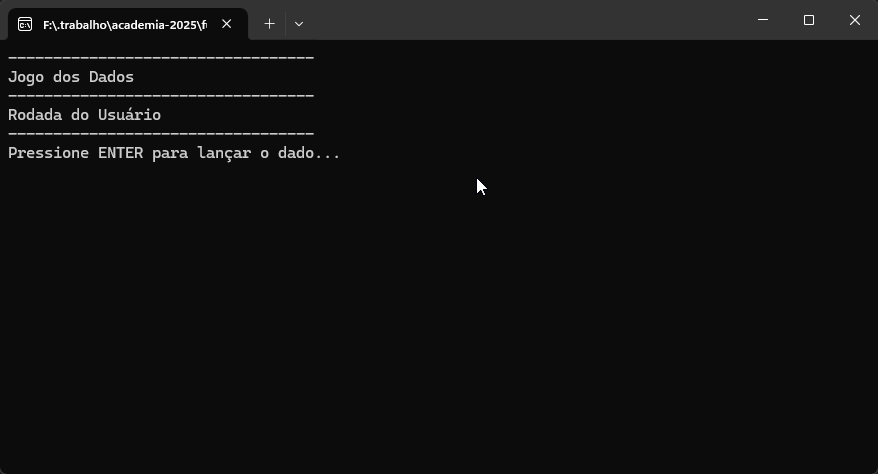

# Jogo Dos Dados



## Introdução

O Jogo dos Dados é um jogo simples baseado em turnos, onde o jogador compete contra o computador para ver quem alcança primeiro a linha de chegada. O jogo implementa eventos especiais que podem acelerar ou retardar o progresso dos participantes.

Regras do Jogo

1. O jogo ocorre em uma pista com um limite de 30 casas.
2. O jogador e o computador jogam alternadamente.
3. Cada turno, um dado é sorteado (valores entre 1 e 6) para determinar o avanço.
4. Eventos especiais ocorrem em determinadas posições:

- Avanço extra (+3 casas):
  - Posições: 5, 10, 15, 25

- Recuo (-2 casas):
  - Posições: 7, 13, 20

5. O primeiro a alcançar ou ultrapassar a linha de chegada vence.

## Como utilizar

1. Clone o repositório ou baixe o código fonte.
2. Abra o terminal ou o prompt de comando e navegue até a pasta raiz
3. Utilize o comando abaixo para restaurar as dependências do projeto.

   ```
   dotnet restore
   ```

4. Para executar o projeto compilando em tempo real

   ```
   dotnet run --project JogoDosDados.ConsoleApp
   ```

## Requisitos

- .NET 10.0 SDK